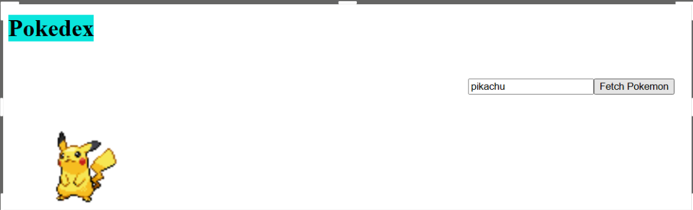

# Pokédex — Modern Pokémon Explorer & Team Builder

A feature-rich, high-performance web application built with Vanilla HTML5, CSS3, and JavaScript that fetches Pokémon data, artwork, sound cries, and species information directly from [PokeAPI](https://pokeapi.co/).

## Key Features

- **Live Autocomplete & Search**: Instant filtering by Pokémon name or National Pokédex ID.
- **Advanced Filtering & Sorting**:
  - Filter by Pokémon Type (18 distinct type badges).
  - Filter by Generation (Gen I through Gen IX).
  - Sort by Dex Number or Name (A-Z / Z-A).
- **Surprise Me Button**: Quick random Pokémon inspection.
- **Detailed Inspection Drawer / Modal**:
  - High-res Official Artwork & Animated Sprites.
  - **Shiny Toggle**: Switch instantly between regular and shiny forms.
  - **Official Audio Cries**: Listen to authentic Pokémon cries in high quality.
  - **Base Stats Visualization**: Color-coded animated progress bars and Base Stat Total calculation.
  - **Dynamic Evolution Tree**: View and navigate through full evolutionary branches with a single click.
  - **Type Matchup Matrix**: Calculate weaknesses, resistances, and immunities.
  - **Pokédex Flavor Text**: Generational entry descriptions and physical attributes (Height, Weight, Category, Abilities).
- **My Team / Favorites System**: Save up to 6 Pokémon to your custom lineup, persisted in `localStorage`.
- **Sound Effects**: UI feedback chimes and volume control toggle.
- **Dark Glassmorphic UI**: Ultra-responsive layout designed with HSL color palettes and micro-animations.

## Project Structure

- `index.html` — Semantic HTML structure, control bars, and modal drawer tabs.
- `style.css` — CSS design system with HSL type colors, glassmorphism, and keyframe animations.
- `script.js` — Vanilla JS application logic, async API caching, evolution parser, and team builder.

## Usage

1. Open `index.html` in any web browser.
2. Search for any Pokémon (e.g. "Charizard", "25", "Lucario") or filter by type and generation.
3. Click any Pokémon card to open the interactive inspection drawer.
4. Click the star icon to save Pokémon to your team.
